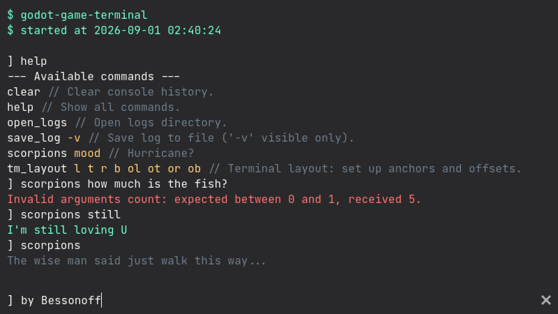

# godot-game-terminal

A simple in-game terminal for Godot 4+



## Features

- Installed as a plugin
- Singleton implementation
- Toggle in-game with [~]
- Command list navigation with [Up] / [Down]
- Autocomplete with [Tab]
- Automatic argument type conversion
- Built-in `help` command
- BBCode support

## Installation

1. Clone this repository into your project's **`addons/`** folder:
    ```bash
    git clone https://github.com/bessonoff-imagine/godot-game-terminal.git
    ```
    Or download the latest [release](https://github.com/bessonoff-imagine/godot-game-terminal/releases/download/godot-game-terminal.zip).
2. Enable the plugin in Godot: **Project Settings → Plugins → check `godot-game-terminal`**.

## Usage

### Register, execute and remove commands

**Register a command** with `Terminal.create_command(name, callback, description, hints)`:

```gdscript
func _ready() -> void:
    # 'description' and 'hints' are optional; they appear in the help output
    Terminal.create_command("version", show_version, "Show version info.", " -p")
    Terminal.create_command("quit", Callable(get_tree(), "quit"), "Exit the game.")

func show_version(bonus: String = "") -> String:
    var msg: String = "--- Version info ---\n"
    msg += "Unnamed project X\n" # name, version
    msg += "by Alan Smithee" # (c)
    if bonus == "-p": msg += "\nPlatform: " + OS.get_name() + " (" + OS.get_version() + ")"
    return msg
```

**Execute a command** with `Terminal.exec(command_line)`:

```gdscript
func new_season() -> void:
    load_dlc_pack
    Terminal.exec("dlc_change_season next")
```

**Remove a command** with `Terminal.remove_command(name)`:

```gdscript
func safe_mode() -> void:
    Terminal.remove_command("quit")
```

### Static and dynamic typing
Arguments are automatically converted to the specified types:

```gdscript
# Arguments auto-converted to float
func teleport(x: float, y: float) -> void:
    position = Vector2(x, y)
```

**Supported types:** `bool`, `int`, `float`, `String`, `StringName`

Or passed as raw strings:

```gdscript
# Arguments received as Strings
func teleport(x, y):
    position = Vector2(x.to_float(), y.to_float())
```

### Returning results
Return a `String` to display results:

```gdscript
func add_money(amount: int) -> String:
    money += amount
    return "Added money: %d (Total: %d)" % [amount, money]
```

You can also use helper methods for formatting and hints:

```gdscript
func cast(spell: String) -> String:
    var result: String = Terminal.hint(spell) + "\n"
    if spell == "Accio":
        result += Terminal.rem("Eat an apple.") + "\n"
        result += Terminal.echo("Dance.") + "\n"
        result += Terminal.spec("Run to the WC.")
    return result
```

## Tips

- Use `Terminal.anchors` and `Terminal.offsets` to position the terminal on screen:
```gdscript
    # LEFT, TOP, RIGHT, BOTTOM:
    Terminal.anchors = Vector4(0.0, 0.0, 1.0, 0.5) # half-screen
    Terminal.offsets = Vector4(0.0, 0.0, 0.0, 0.0)

    # or take the built-in command
    Terminal.exec("tm_layout 0.0 0.0 1.0 0.5 0.0 0.0 0.0 0.0")
```
- Edit `_tm_vfx` in `../core/terminal.gd` for custom appearance
- Remove `open_logs` and `save_log` commands with functions from **`../core/container.gd`**, if needed

## License

Copyright (c) 2026 Bessonoff

Unless otherwise specified, files in this repository are licensed under the MIT license. See [LICENSE.md](LICENSE.md) for more information.